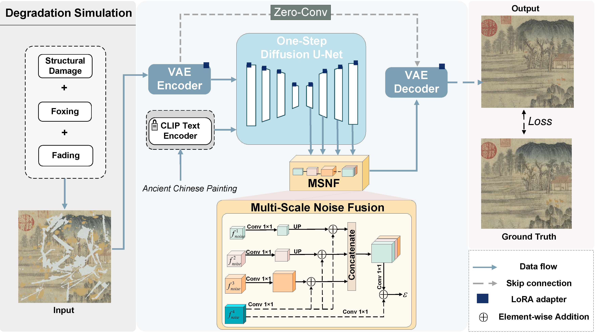

# DiffAPR: A Benchmark and Restoration Framework for Ancient Paintings under Compound Degradation 

* We provide related codes and configuration files to reproduce the "DiffAPR: A Benchmark and Restoration Framework for Ancient Paintings under Compound Degradation"

## 🌟 Highlight
<p align="center">
  
</p>


+ We construct **(ACP3K)**, a high-resolution dataset of ancient Chinese paintings, and simulate progressive degradations such as ink fading, mold infestation, and physical damage to reflect real-world deterioration.
+ We introduce **(DiffAPR)**, a Diffusion-based Ancient Painting Repair framework that enables high-quality recovery in a single inference step without requiring any masks.
+ We design a Multi-Scale Noise Fusion (MSNF) module to enhance the reconstruction of fine details and stylistic consistency under complex degradation.


## 🔥 Model download
| **Model**                                    | **chekcpoint** | **status** |
|----------------------------------------------|----------------|------------|
| **DiffAPR**                              | [GoogleDrive](https://drive.google.com/drive/folders/1GI7PjDbHT8dop52_TE13BTJDfw6hHY9V) / [BaiduYun:x62f](https://pan.baidu.com/s/1RMgdK2CmDLrLCH6VQ90dbg?pwd=qscr) | Released  |

## 🔥 Test Dataset download
| **Test Dataset**                                    | **dir** | **status** |
|----------------------------------------------|----------------|------------|
| **DiffAPR**                              | [GoogleDrive](https://drive.google.com/drive/folders/1ftlC6AU84olEm_nNwY--ULofX0-rEfSX) | Released  |


<p align="center">
  
</p>

## Train the model
Train with options from a config file:
```bash
python train.py --config configs/acp.yml
```


## Inference Dataset
Before running the following commands make sure to put the downloaded weights file into the `checkpoints` folder.
```bash
python inference.py
```

## Inference on a Single Image
Before running the following commands make sure to put the downloaded weights file into the `checkpoints` folder.
```bash
python inference_single.py
```

## Requirements
  + python3
  + pytorch
  + torchvision
  + numpy
  + Pillow
  + tensorboard
  + pyyaml
